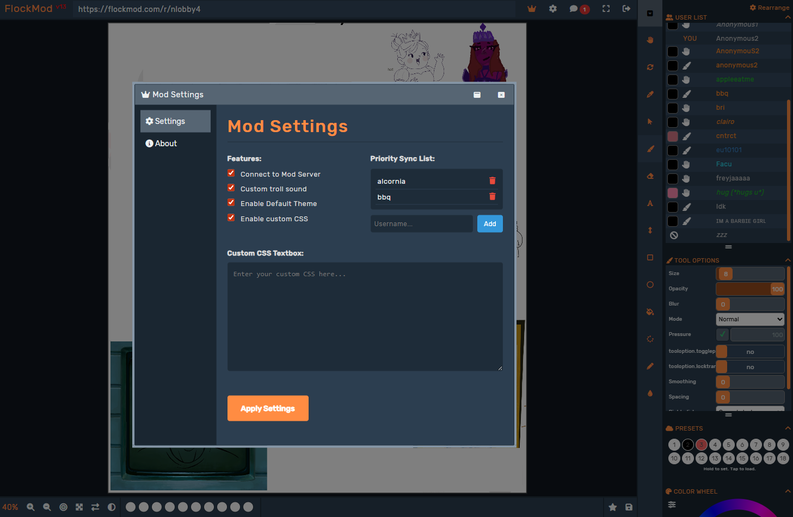

# Flockmod Desktop App

A lightweight desktop wrapper for Flockmod using [Tauri](https://tauri.app), featuring custom modifications and enhancements for an improved drawing experience.

## Overview

This Tauri-based application provides a native desktop experience for Flockmod with a dramatically reduced installation size:
- **Original Electron app**: ~430MB
- **Tauri version**: ~12MB

Tauri leverages Windows' built-in WebView2 browser, enabling excellent performance with minimal disk space usage.

## Key Features

### Custom Mod Menu
Access the mod settings menu via the crown icon in the top navigation bar.

**Main Features:**
- **Modded User Network**: Connect to a private server to see and sync preferentially with other modded users
- **Priority Sync List**: Configure a list of usernames to prioritize syncing with first
- **Custom Theme**: A new default theme of dark blue and orange - can be toggled off in the options
- **Troll Detection**: Automatic detection with custom sound alert and flashing visual highlighting in the userlist
- **Custom CSS Support**: Apply persistent custom CSS styling to personalize your Flockmod app however you like
- **Auto XL Resolution**: Automatically sets board size to 2160x1920 in XL rooms

- **Persistent Settings**: All mod configurations are saved between sessions

### *A large number of tweaks in Zexium's mod menu, at the bottom right of the board, specified below*
---

## Zexium's Flockmod Enhancements

### Dynamic Opacity Toggle
- A new toggle in the brush tool settings allows opacity to dynamically adjust based on your pen pressure.
- Users can set specific pressure thresholds to fine-tune the behavior in the mods dialog.

### Lock Transparency
- A new toggle that prevents changes to transparent pixels on the canvas, allowing you to paint only on existing content.

### Lock Transparency
- A new toggle that prevents changes to transparent pixels on the canvas, allowing you to paint only on existing content.
- Blend modes work correctly ONLY when both pressure AND dynamic opacity toggles are off.
- If either pressure or dynamic opacity is enabled, blend mode is forced to Normal due to performance issues.

### Mods Dialog
A new **Mods** button opens a dialog with several tabs for customization and additional features:

#### 1. **Statistics Tab**
Track your activity with detailed stats:
- **Room Times:** A stopwatch feature that records how much time you spend in Flockmod rooms and actively drawing.
- **Session and Total Times:** View your stats for the current session and overall usage.
- **IP Stats:** Collects statistics and draws visual graph on total users online and unique IP's number per day/week/month/year.
  - *Note:* IP stats are expected to be used within the same room without switching to other ones.

## Tweaks Tab

Adjust settings on the fly and explore advanced options:

1. Dynamic Opacity Thresholds: Configure threshold settings for the new dynamic opacity feature.
   - Max Opacity Size: Determines the brush size threshold at which the opacity reaches 100%.
     - If set to 2px and using an 8px brush, the opacity will be 100% for brush sizes between 2px and 8px.
     - Below 2px, opacity decreases proportionally. For instance, at 1px (12.5% pressure), the opacity would be 50%.
   - Opacity Change Threshold: Regulates the delta required when changing pressure.
     - If set to 0.05, opacity updates only if it changes more than 0.05; opacity will go 5, 10, 15, 20, ...
     - If set to 0, it will overlap the line more often, making it darker since it layers on itself.

2. Smart Opacity Cap: Dynamically adjusts the maximum opacity threshold based on brush size.
   - If your max opacity size is 2px and your brush is 8px, at 2px your opacity will be 100%.
   - If you reduce your brush to 1px, the max opacity size automatically adjusts to 1px.
   - When increasing the brush size above the threshold, the max opacity size returns to the original setting.

3. Mouse Mode: The faster you move the cursor, the lower the opacity gets.

4. Blur Control: Test feature that sets blur value to 4–5 based on pressure. If sharp pixels are enabled, lines will appear more anti-aliased, giving a more Photoshop-like look.
   Note: Blur isn’t visible on other clients at such low values, causing desync.

5. Smoothing for Resize: Enable smooth resizing. If disabled, resizing will appear pixelated.

6. Mouse Wheel Control:
   - Vanilla FM: Standard controls.
   - Faster Scroll = Faster Changes: Faster scrolling increases size change per tick. Holding Shift forces a 1px change.
   - Cap: Up to size 15, brush size changes by 1px. Beyond size 15, it changes by 2px without Shift and 1px with Shift.

7. Bypass DENIED#101 Error: Modifies the frame buffer to throttle packet sending, preventing kicks due to having the console window open.

8. Position-Aware Mirroring: Makes canvas flipping relative to your current board position and rotation angle.

9. Additional Mirrored Text While Flipped: Shows a mirrored text preview when flipped (preview only, not placed).

10. RMB Action Fix: Fixes unintended RMB activation when wiggling the pen in place.

11. Reset Pressure on Release: Resets pressure to 0 when lifting the pen from the tablet.

12. Persistent Board Sync: Retains color, tool, zoom, and board position after disconnecting.

13. Hold to Pick Color: Allows continuous color picking while holding the picker.

14. Fix Selection Options Stuck: Prevents selection options from staying grayed out.

15. Fix Resizing Shift: Fixes the ~4px shift when starting a transform.

16. Reconnect-Aware Sync: Skips syncing if you reconnect within 20 seconds.

17. Instant Reconnect: Immediately sends a reconnect command on disconnect.

18. Quick Launch: Skips the 5-second startup timer.

19. Unlimited Reconnect Attempts: Keeps retrying reconnects if servers go down.

20. Detect Trolling: Highlights users drawing while moving the cursor abnormally fast (non-staff only).

21. Troll Sound: Plays a selectable sound when trolling is detected.

22. Keep Tab Alive: Prevents disconnects when the tab is inactive.

23. Disable Blur: Removes blur effects for better performance.

24. Revert to Pre-Marching Ants Resizing: Restores classic resize visuals.

25. Extended Board by Default: Sets XL board size to 1920x2160.

26. 10% Zoom Step: Changes zoom steps from 25% to 10%.

27. Precise Zoom Display: Displays zoom with decimal precision (e.g., 100.1%).

28. Skip Syncing: Makes the “Too slow? Skip this user” button always available.

29. Fix Auto Scroll: Improves chat auto-scroll behavior.

30. Fix Copy Action: Preserves timestamps when copying chat messages.

31. Export/Import Config: Export and import all mod configuration data and stats.
---
#### 3. **Messenger Controls Tab**
Improved control over social interactions:
- **Block Users:** Block users directly from the messenger (right-click on a user to block them), or type in their username in Mods Dialog.
- **Blocked User Behavior:**
  - No sound notifications from blocked users.
  - Chat won't display unread messages from them.
  - Blocked users won't move to the top of the messenger list.
  - You can still view blocked users' messages if you want to.

#### 4. **Undo History Tab**
Gain greater control over your drawing with client-side undo/redo functionality:

- **Client-Side Undo/Redo:** Undo and redo individual strokes without affecting other users.
- **Smart Broadcasting:** Only broadcasts committed strokes to others. For example, if undo length is set to 5, once you draw the 6th stroke, the 1st is committed (as you can no longer undo to it).
- **Undo Controls:**
  - **Commit All Changes:** Commits your current board state to other users while allowing you to continue drawing.
  - **Toggle Undo History:** Switch between undo mode (for solo drawing) and normal mode (for collaboration).
  - **Clear History:** Force delete all undo data (useful after unexpected disconnections).
- **Default Behavior Options:**
  - **Always Enabled:** Undo history is automatically enabled at startup.
  - **Always Disabled:** Undo history starts disabled by default.
  - **Recorded State:** Remembers your last undo toggle state between Flockmod sessions.

**Known Issues with Undo:**
- When selecting content on one layer and moving it to another layer, undoing this action may not properly remove the content from the destination layer.
- After completing a transform/resize action with selection, you may need to hover over the UI before drawing again.
- Drawing with console open may cause desync.
---
## **Bug Fixes**

1. **RMB Action Unexpected Behavior:** Fixed an issue where the right mouse button caused unexpected actions.

3. **Pressure Not Reset to 0:** Resolved a bug where pressure levels were not reset to 0 when expected.

---

## **Useful Features**

### **Zoom Tool**
Set up the hotkey in FM settings. While holding that key:
- Swipe to the right to zoom in.
- Swipe to the left to zoom out.

Works similarly to Photoshop's zoom tool.

### **Pixel Tool Eraser Mode**
A dedicated hotkey to quickly toggle eraser mode when using the pixel tool.

---

### Building from Source

**Prerequisites:**
- [Rust](https://www.rust-lang.org/)
- [Node.js](https://nodejs.org/)

**Steps:**
```bash
git clone [your-repo-url]
cd flocktauri
npm install

# Development
npm run tauri dev

# Production build
npm run tauri build
```

---
